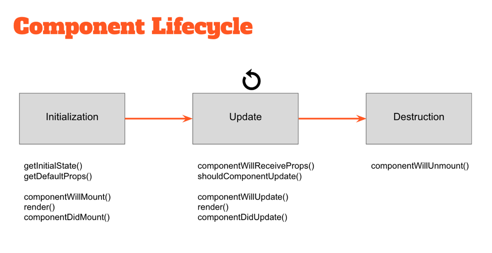

1. What are the alternatives to the `class` syntax? What's the benefit of `class` syntax?
  * React.createClass (ES5)
    * const Puppies = React.createClass ({...})
    * React automatically binds 'this'
  * React.Component (ES6)
    * class Puppies extends React.Component {constructor(props) {super(props)}}
    * must be used with Babel to compile ES6 to work in other browsers
    * can use 'this', but MUST bind through Constructor(props)/super(props), inline binding or fat arrow functions
    * Use if need lifecycle methods
      
    * Better suited for 'Higher Order Componenets'
    * Does not have the function: getDefaultProps() or getInitialState()
      * initial state is set with the Constructor after calling super
  * Stateless functional components
    * Don't have 'this' object
    * No lifecycles
    * Cannot have state
    * Simple! Take on props, render props
    * Use whenever you can!
2.  What is JSX?
   ["JSX is a Javascript syntax extension created by Facebook"][ref1]
  * Is adds XML syntax to javascript
    * It is like a mixture of HTML and javascript AND css
  * You can wrap expressions within html by using {}
  ```js
      function formatName(user) {
        return user.firstName + ' ' + user.lastName;
        }
      const user = {
        firstName: 'Harper',
        lastName: 'Perez'
        };
      const element = (
        <h1>
          Hello, {formatName(user)}!
        </h1>
        );
      ```
  * Can use INSIDE OF if statements and for loops
    * BUT cannot use if statement in JSX expression
  * if an element does not nest any other elements, you can close it immediately with a "/>", just like image tags
  * Why use it?
    * JSX is faster because it compiles the source code into Javascript
  * It is not valid Javascript, so it must be compiled (like with a compiler like Babel)

3. What is the difference between the following:
  * import React from 'react';
    * This is how you access the React library
    * If you want to use JSX inside a module, you must import react
    * Allows you to use 'class' syntax

  * import { render } from 'react-dom';
    * this is the entry point to the react-dom library
    * the react-dom library deals with all the DOM stuff we do (it provides DOM specific methods)
    * We need to have a place to render this, so react-dom sends it to the DOM
    * can use import ReactDOM from 'react-dom'

  * import Component from './components/Component'
    * Allows you to import Component directly if you have multiple components in one file
    * Allows you to import components from a different js file to communicate with the current js file

  * import './style.css'
    * This will import a stylesheet, so you can use classes and ids to make style changes or apply stlye changes (to objects created with CompositeComponent)

4. What is the shadow DOM?
  * The shadow DOM allows one to create self-contained and customizable elements that you can import into a project. It allows you to include a subtree of DOM elements into rendering of a document without affecting the the main document DOM tree. This is a way to create "customized" html/css that will not in any way affect the rest of your document
  * React does not need Shadow Dom since it allows you to create your own components that are customizable and self-contained and can be reused. It also uses a virtual DOM which compares the new virtual DOM to a pre-update version, and React figures out exactly which virtual DOM objects have changed. (called diffing) Now react can update those objects and only those objects (only updates necessary parts of DOM)

5. If we want to output multiple paragraphs, what gotcha might we run into?
  * [You can't output miltiple adjacent elements.][multiple elements]
  * You can only output ONE element, but you can have as many children as needed.
  * CANNOT
    ```js
    ReactDOM.render(
      <h1>Batman</h1>
      <h1>Iron Man</h1>
      <h1>Nicolas Cage</h1>
      <h1>Mega Man</h1>,
      destination
    );
    ```
  * CAN
    ```js
      ReactDOM.render(
        <div>
          <h3>Batman</h3>
          <h3>Iron Man</h3>
          <h3>Nicolas Cage</h3>
          <h3>Mega Man</h3>
        </div>,
        destination
      );  
    ```
  * put all children in one element that you can output, like a div

6. How do we make an HTML comment within JSX?
    ```JSX
    {/* Comment Here */}

    {/*
      multiple
      line
      comment
    */}
    ```
7. In JSX, how do we handle css selectors that have dashes?
  * You use camelCase for example:
    * background-color = background-color
    * border-radius = borderRadius

8. How do we pass data between components?
  * Props: send data from parent to children
  * Ref functions: parent to children
    * write method in chid component, call that method in parent component (this.ref.refName.functionName)
  * Call functions: child to parent
    * parent passes function to child as a prop, child calls the function that is declared in its propTypes
  * Wrap multiple components in a parent components
  * Global variables
    * set variable to window (ex. window.cats) in a component and it can be read in another component

9. What are props and states and how do they differ?
  * props
    * data that is passed from parent component to child component (communication btwn components)
    * access parameters passed from the parent
    * read-only by component

  * state
    * looks and works just like props, except an owning component or different component can change its state
    * private data(object) of your component
    * optional - avoid if can so you can have stateless components
    * deals with changing/dynamic data


# For Classmates
* How does the interactions btwn the view and the DOM relate to the browser refreshing at 60 Hz
* Do we include the library and react file in webpack or in the scripts.js file? Where do we put these nice things?


[ref1]:http://stackoverflow.com/documentation/reactjs/797/getting-started-with-react#t=201610291613059856965
[multiple elements]:https://www.kirupa.com/react/components.htm

(class vs createClass)[https://daveceddia.com/react-es5-createclass-vs-es6-classes/]

(styling in react)[https://www.kirupa.com/react/styling_in_react.htm]

(communicating components)[http://andrewhfarmer.com/component-communication/]

(webpack)[https://tylermcginnis.com/react-js-tutorial-1-5-utilizing-webpack-and-babel-to-build-a-react-js-app-5f804d729d3b#.tfkrn5g1v]

(install example 1)[http://stackoverflow.com/documentation/reactjs/6441/installation#t=20161030203829663441]

(install example 2)[http://stackoverflow.com/documentation/reactjs/6294/how-to-setup-a-basic-webpack-react-and-babel-environment#t=201610302039465462421]

(install example 3)[http://stackoverflow.com/documentation/reactjs/5969/react-boilerplate-react-babel-webpack#t=201610302041483142306]

(difference btwn ES5 & ES^ components)[https://babeljs.io/blog/2015/06/07/react-on-es6-plus]
